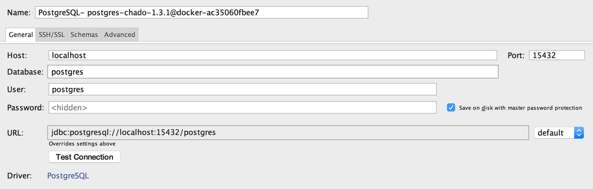
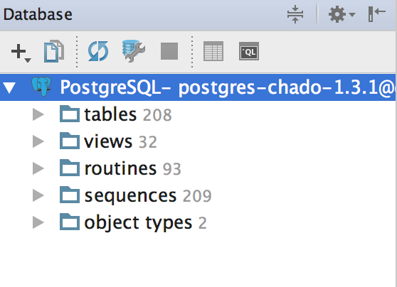

### 项目介绍

该仓库用于学习并理解 Chado 数据库而建，让自己更全面、更透彻地了解业务。

Chado 的字面直译，即为 `茶道`。

### Chado 介绍

Chado 是一个关系型数据库的模型，`GMOD`(Generic Model Organism Database) 的众多产品都以 Chado 作为数据持久化的后端存储，并通过模块化的思想，将各个模块组件进行组合。

在现代生物学中，多种生物数据，如 `sequence, sequence comparisons, phenotypes, genotypes, ontologies, publications, phylogeny` 等，都可以通过该数据库进行展现。数据库设计的初衷就是为了能更好地组织并展示复杂的`生物学知识`(Biological Knowledge)。

设计之初，是为了果蝇数据而设计，慢慢发展成为更具通用性、适合任何物种的数据库。

### 模块

模块列表

模块名|作用|
---|---|
Audit | 日志模块，用于记录登入登出等行为 |
Companalysis | 分析数据，记录计算分析后的数据 |
Contact | 人员组织信息 |
Controlled Vocabulary (cv) | 分类信息 |
Expression | RNA 和 protein 表达量信息 |
General | 用户认证 |
Genetic | 基因、基因型(`genotype`)数据 |
Library | 分子数据库的描述信息 |
Mage | 微阵列数据。`微阵列`是一系列可以代表该物种整个基因集的DNA序列集合，在遗传检测中通常排列在一个芯片矩阵中使用 |
Maps | TODO |
Natural Diversity (ND) | TODO |
Organism | 物种信息 |
Phenotype | Phenotype 数据 |
Phylogeny | 物种、发生树信息 |
Publication | 发布的文章相关信息 |
[Sequence](./modules/Sequence.md) | 序列及序列特征信息 |
Stock | 样本及生物数据 |
WWW- | TODO |

各个模块与模块之间相互依赖 (`ps: 其声称的模块化思想，有待考查，这不是模块化思想`)。

[数据字典](./DICT.md)

### 安装

本机环境，以 `Docker` 为例

* Mac OS version 10.13.2
* Docker version 17.06.2-ce, build cec0b72
* PostgreSQL 9.5
* Chado 1.31

```bash
$ wget https://raw.githubusercontent.com/GMOD/Chado/master/chado/schemas/1.31/default_schema.sql -O chado-1.3.1.sql
$ docker run --name postgres-chado-1.3.1 \
    -e POSTGRES_PASSWORD=chadopwd123 \
    -v /Users/a2htray/Desktop/BGI_BIG_DATA/GENE_DATABASE/chado/data/sql:/opt/chado/sql \
    -v /Users/a2htray/Desktop/BGI_BIG_DATA/GENE_DATABASE/chado/data/db:/var/lib/postgresql/data \
    -p 15432:5432 \
    -d postgres:9.5
$ docker exec -it postgres-chado-1.3.1 /bin/bash
# 在容器内执行
$ su - postgres
$ psql -h localhost -d postgres -U postgres -p 5432 -a -q -f /opt/chado/sql/chado-1.3.1.sql
```

使用数据库连接客户端，如 DataGrip 进行连接并查看





<!-- TODO -->

(`ps: 目前的想法是希望通过 PHP 框架 Laravel 的包开发模式进行项目的集成，故后面会着手 Chado 相关包的开发。`)

### 格式

* fasta : 序列的格式

### 术语

* exon 外显子
* 5'UTR 和 3'UTR : 不行使具体功能，起到调控作用
* 转录: Gene 变成 mRNA，Gene 可转变多个 mRNA，RNA 只能来自一个 Gene
* 翻译: RNA 变成 Protein，RNA 和 Protein 一一对应
* mRNA : TODO
* rRNA : TODO
* tRNA : TODO

一条染色体是一个 DNA 分子

* 表达量 : 不同组织上 RNA 表达的

### 资源

* [维基百科 Chado] ](http://gmod.org/wiki/Chado)